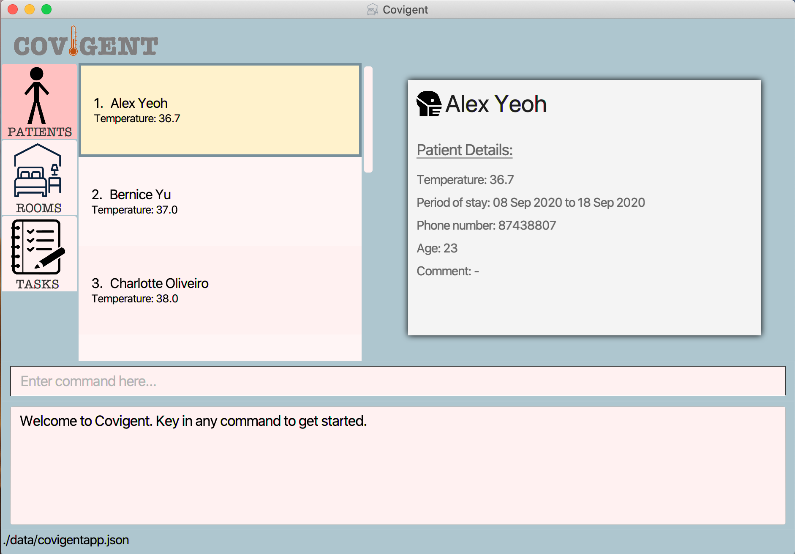

# Covigent - User Guide

1. [Introduction](#1-introduction)
2. [Quick Start](#2-quick-start)
3. [Features](#3-features) 
    3.1 [Command Format](#31-command-format) 
    3.2 [Add a patient: `addpatient`](#32-add-a-patient-addpatient) 
    3.3 [Delete a patient: `deletepatient`](#33-delete-a-patient-deletepatient) 
    3.4 [Edit a patient: `editpatient`](#34-edit-a-patient-editpatient) 
    3.5 [Search information: `searchpatient`](#35-search-information-searchpatient) 
    3.6 [Add rooms in hotel: `addRooms`](#36-add-rooms-in-hotel-addrooms) 
    3.7 [Find the first free room: `findRoom`](#37-find-the-first-free-room-findroom) 
    3.8 [View help: `help`](#38-view-help-help) 
    3.9 [Save the data](#39-save-the-data) 
 4. [FAQ](#4-faq)
 5. [Command Summary](#5-command-summary)

--------------------------------------------------------------------------------------------------------------------

## 1. Introduction

Covigent is a desktop app for managing information of quarantined individuals and the tasks to be done by staff of the quarantine facility. It is optimized for use via a Command Line Interface (CLI) while still having the benefits of a Graphical User Interface (GUI). If you type fast, Covigent can improve your efficiency in managing your patients and tasks instead of using traditional GUI apps.

## 2. Quick start

1. Ensure you have Java `11` or above installed in your Computer.

1. (*Coming soon*) Download the latest `covigent.jar` from [here](https://github.com).  

1. Copy the file to the folder you want to use as the _home folder_ for the application.

1. Double-click the file to start the app. The GUI similar to the below should appear in a few seconds. 
   

1. Type the command in the command box and press Enter to execute it.  
   Some example commands you can try:

   * **`addpatient`** `n/John Doe t/37.4 d/20200910-20200924 p/98765432 a/35` : Adds a quarantined individual named `John Doe` to the application.

   * **`editpatient`** `Mary t/36.7 p/91234567` : Updates the temperature and phone number of an individual named `Mary` to 36.7 and 91234567 respectively.

1. Refer to the [Features](#features) below for details of each command.

--------------------------------------------------------------------------------------------------------------------

## 3. Features

### 3.1 Command Format
**:information_source: Notes about the command format:** 

* Words in `UPPER_CASE` are the parameters to be supplied by the user. 
  e.g. in `addpatient n/NAME`, `NAME` is a parameter which can be used as `addpatient n/John Doe`.

* Items in square brackets are optional. 
  e.g `n/NAME [c/COMMENT]` can be used as `n/John Doe c/Is vegan` or as `n/John Doe`.

* Parameters can be in any order. 
  e.g. if the command specifies `n/NAME p/PHONE_NUMBER`, `p/PHONE_NUMBER n/NAME` is also acceptable.
  

### 3.2 Add a patient: `addpatient`

Adds a quarantined individual to the application.

Format: `addpatient n/NAME t/TEMPERATURE d/PERIOD_OF_STAY p/PHONE_NUMBER a/AGE [c/COMMENT]`

* Adds a quarantined individual with the specified name, temperature, period of stay, phone number and age.
* Temperature must be to 1 decimal place (e.g. 37.0 instead of 37).
* Period of stay is in the format YYYYMMDD-YYYYMMDD.
* It is optional to include the comment field for the quarantined individual.

Examples:
* `addpatient n/John Doe p/98765432 t/37.4 d/20200910-20200924 a/35`
* `addpatient n/Betsy Crowe t/36.5 d/20201001-20201014 p/91234567 a/19 c/Is asthmatic`

### 3.3 Delete a patient: `deletepatient`

Deletes an existing patient in the application.

Format: `deletepatient NAME`

* Deletes the patient with the specified `NAME`. The name refers to the name of the patient inputted into the application earlier. The name **must match exactly with the name of the patient**.
* `NAME` is case-insensitive.

Example:
* `deletepatient Mary Doe` Deletes the patient record of Mary Doe from the application.

### 3.4 Edit a patient: `editpatient`

Edits an existing patient in the application.

Format: `editpatient NAME [n/NAME] [t/TEMPERATURE] [d/PERIOD_OF_STAY] [p/PHONE_NUMBER] [a/AGE] [c/COMMENT]`

* Edits the patient with the specified `NAME`. The name refers to the name of the patient inputted into the application earlier. The name **must match exactly with the name of the patient**.
* At least one of the optional fields must be provided.
* Existing values will be updated to the input values.
* `NAME` is case-insensitive.
* `TEMPERATURE` must be to 1 decimal place (e.g. 37.0 instead of 37).
* `PERIOD_OF_STAY` is in the format YYYYMMDD-YYYYMMDD.

Examples:
*  `editpatient john doe p/91234567` Edits the phone number of john doe to be `91234567`.
*  `editpatient alex t/36.7 a/21 d/20200303-20200315` Edits the temperature, age and period of stay of alex to be `36.7`, `21` and `20200303-20200315` respectively.

### 3.5 Search information: `searchpatient`

Searches the patients that matches the given criteria in the application.

Format: `searchpatient [n/NAME] [tr/TEMPERATURE_RANGE]`

* Only one of the fields can be provided.
* The temperature range is inclusive of start and end temperatures.

Examples:
*  `searchpatient n/john` Searches patients with a name John.
*  `searchpatient tr/36.5-36.7` Searches patients with temperature 36.5 to 36.7 degree, celsius, both inclusive. 

### 3.6 Add rooms in quarantine facility: `addRooms`

Adds the number of rooms in the quarantine facility to the app.

Format: `addRooms NUMBER_OF_ROOMS`

* Adds NUMBER_OF_ROOMS rooms into the hotel system

Examples:
* `addRooms 123`
* `addRooms 400`

### 3.7 Find the first free room: `findRoom`

Finds the room with the lowest room number that is free for use.

Format: `findRoom`

* Finds the room number of least value that can be safely used for accommodation

### 3.8 View help: `help`

Shows a message explaining how to access the help page.

Format: `help`

### 3.9 Save the data

Covigent data are saved in the hard disk automatically after any command that changes the data. There is no need to save manually.

--------------------------------------------------------------------------------------------------------------------

## 4. FAQ

**Q**: How do I transfer my data to another Computer? 
**A**: Install the app in the other computer and overwrite the empty data file it creates with the file that contains the data of your previous Covigent home folder.

--------------------------------------------------------------------------------------------------------------------

## 5. Command summary

Action | Format, Examples
--------|------------------
**Add Patient** | `addpatient n/NAME t/TEMPERATURE d/PERIOD_OF_STAY p/PHONE_NUMBER a/AGE [c/COMMENT]`   e.g.,`addpatient n/Betsy Crowe t/36.5 d/20201001-20201014 p/91234567 a/19 c/Is asthmatic`
**Edit Patient** | `editpatient NAME [n/NAME] [t/TEMPERATURE] [d/PERIOD_OF_STAY] [p/PHONE_NUMBER] [a/AGE] [c/COMMENT]`  e.g.,`editpatient James Lee t/36.5`
**Search Patient** | `searchpatient [n/NAME] [tr/TEMPERATURE_RANGE]`   e.g., `searchpatient tr/36.5-36.7`
**Add Rooms** | `addRooms NUMBER_OF_ROOMS`   e.g., `addRooms 123`
**Find Room** | `findRoom`   
**Help** | `help` 

